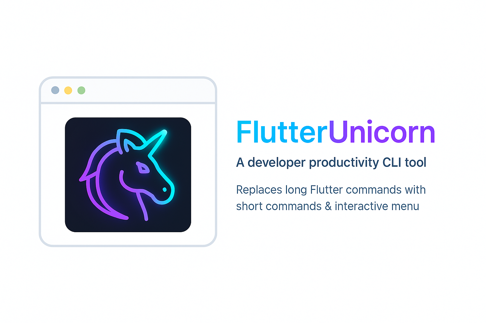
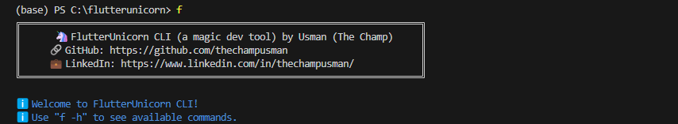
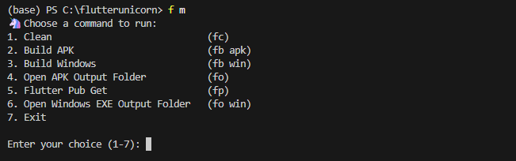
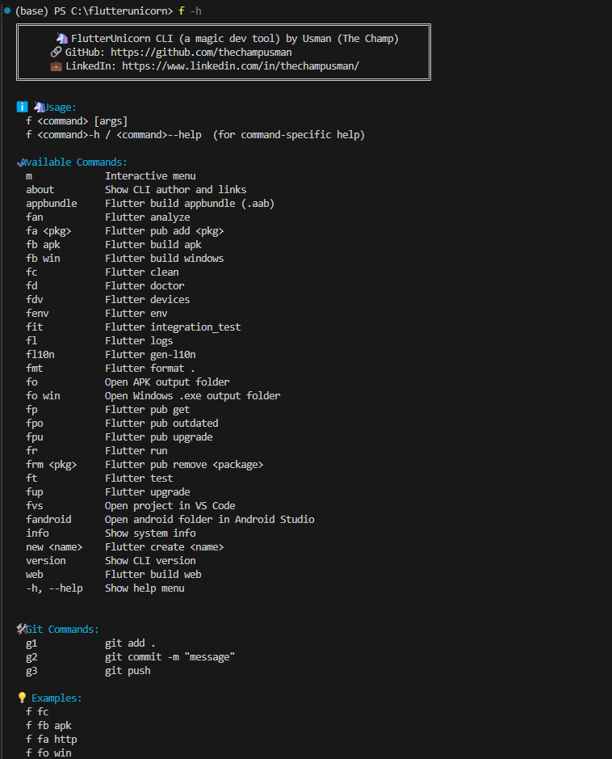

# 🦄 FlutterUnicorn CLI

[📖 Full Usage Guide](docs/USAGE.md)

## 🖼️ Banners

<p align="center">
  
</p>
<p align="center">
  
</p>

---

## ✨ Some Glimpses

<p align="center">
  
  
    <em>Interactive menu in action</em>
  
</p>

> **Blazing-fast custom CLI for Flutter developers.**  
> Interactive menu, color output, and powerful shortcuts.  
> Speed up your daily Flutter and Git workflow with intuitive commands like `f fc`, `f fb apk`, `f g2 "commit message"` and more.

---

## 📦 Features

- ✅ One-letter shorthand for Flutter commands  
- ✅ Git shortcuts (add, commit, push)  
- ✅ Interactive beginner-friendly menu (`f m`)  
- ✅ Command-specific help (`f fc-h`)  
- ✅ Colorful output (no external packages used)  
- ✅ Fully cross-platform source: works on Windows, Linux, macOS  
- ✅ VS Code / Android Studio integration  
- ✅ Just one lightweight binary (`f.exe`) for Windows  

---

## 🚀 Quick Start (Windows)

   1. **Download `f.exe`** from the [Releases](https://github.com/thechampusman/flutter_unicorn/releases) page.
   2. Place it somewhere like `C:\tools\flutter_unicorn\`
   3. Add that folder to your system **PATH**   
   4. Open any terminal and run:
   ```sh
   f -h
   ```
## OR (Use with out adding to PATH)

   1. **Download `f.exe`** 
   2. Place it in flutter/bin folder (locate your flutter SDK)
      And All DONE !!


## Linux & MacOS 

   1. Download the f binary for your OS from Releases
        (or compile it yourself with dart compile exe bin/flutterunicorn.dart -o f on your platform)
   2. Place it in a folder like `~/bin` or `/usr/local/bin`
   3. Make it executable:
      ``` ** chmod +x f **
      ```
   4. Add that folder to your PATH if needed
   5. Use from any terminal!. (same commands)

## Setup using Terminal (Linux & MacOS)

   (** assuming that you are in download folder and already downloaded f binary file from release**)
   1. Move f to a directory in your PATH, such as /usr/local/bin or ~/bin:
      ``` sudo mv f/usr/local/bin/ ```
       or (if you have a ~/bin in your PATH):
      ``` mv f ~/bin/ ```
   2. Make sure it's executable:
      ``` chmod +x /usr/local/bin/f ``` 
   3. Use any commands for any terminal.
---

## 📚 All Commands

### 🧩 Flutter Shortcuts

| Command         | Description                               |
|-----------------|-------------------------------------------|
| f fc            | Flutter clean                             |
| f fb apk        | Build Android APK                         |
| f ft            | Run all tests                             |
| f fb win        | Build Windows executable                  |
| f appbundle     | Build Android AppBundle (.aab)            |
| f fr            | Run the app                               |
| f fit           | Run integration tests                     |
| f fan           | Flutter analyze                           |
| f fmt           | Format all Dart files                     |
| f fenv          | Show Flutter environment                  |
| f fpo           | Show outdated packages                    |
| f fpu           | Upgrade all packages                      |
| f fup           | Upgrade Flutter SDK                       |
| f fd            | Flutter doctor                            |
| f fdv           | List connected devices                    |
| f fl            | Show Flutter logs                         |
| f fl10n         | Generate localization files               |
| f fo            | Open APK output folder                    |
| f fo win        | Open Windows exe output folder            |
| f fa <pkg>      | Flutter pub add <pkg>                     |
| f far <pkg>     | Flutter pub remove <pkg>                  |
| f frm <pkg>     | Flutter pub remove <pkg> (alias)          |
| f fp            | Flutter pub get                           |
| f new <name>    | Create new Flutter project                |
| f fvs           | Open project in VS Code                   |
| f fandroid      | Open Android folder in Android Studio      |
| f web           | Build Flutter web                         |
| f about         | Show author and links                     |
| f info          | Show system info                          |
| f version       | Show CLI version                          |
| f m             | Launch interactive menu                   |
| f -h            | Show usage/help                           |
| f <cmd>-h       | Help for any specific command             |

---

### 🛠️ Git Commands

| Command         | Description                |
|-----------------|---------------------------|
| f g1            | git add .                 |
| f g2 "msg"      | git commit -m "msg"       |
| f g3            | git push                  |

---

## 💡 Usage Examples

```sh
f fc                         # Clean project
f fb apk                     # Build Android APK
f fa http                    # Add 'http' package
f fo win                     # Open Windows build output
f g2 "initial commit"        # Commit code
f g3                         # Push to remote
f m                          # Interactive menu
```

---

## 🛡️ Privacy & Trust

> **Your privacy is 100% respected.**
>
> - This tool does **not** collect, transmit, or store any of your data.
> - No analytics, no tracking, no "improve experience" popups—**nothing leaves your machine**.
> - All your code, commands, and workflow are **yours and yours alone**.

Enjoy full peace of mind while boosting your productivity!


---

## 📬 Feedback

💬 Want to suggest a new feature or command?  
📧 Email: usmangourworkid@gmail.com  
🕸️ GitHub: https://github.com/thechampusman/  
🔗 LinkedIn: https://linkedin.com/in/thechampusman/

---

## 🔗 Source & Updates

🔐 This CLI is private & not open-source.  
🚀 Download updates at: https://github.com/thechampusman/flutter_unicorn/releases

---

## 🧠 Author

**Usman Gour**  
Mobile & Windows App Developer (Flutter Expert)  
🦄 Creator of FlutterUnicorn CLI  
🔗 [GitHub: @thechampusman](https://github.com/thechampusman)
  

---

